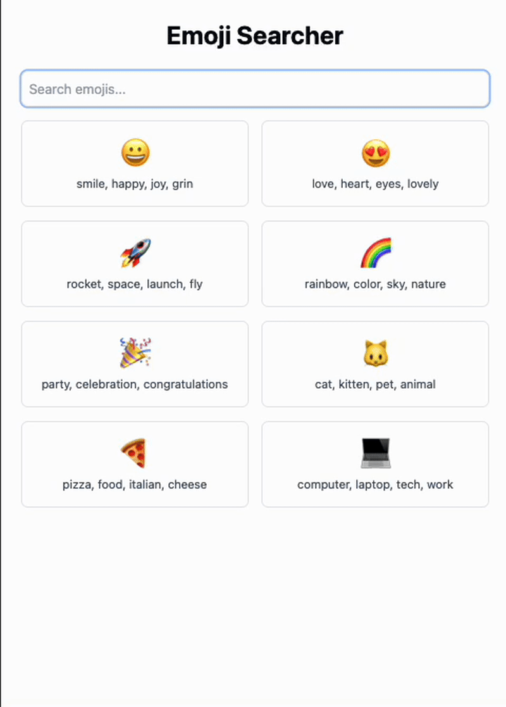
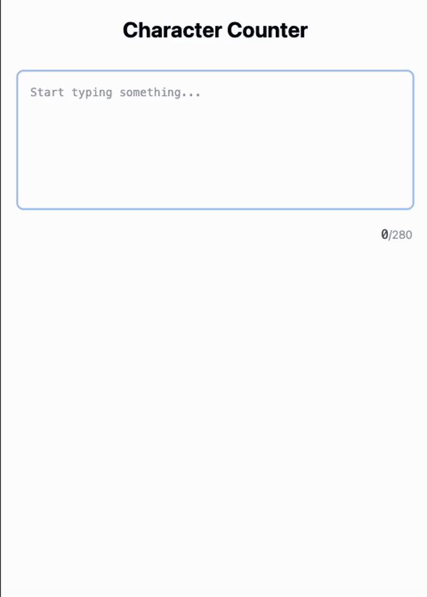
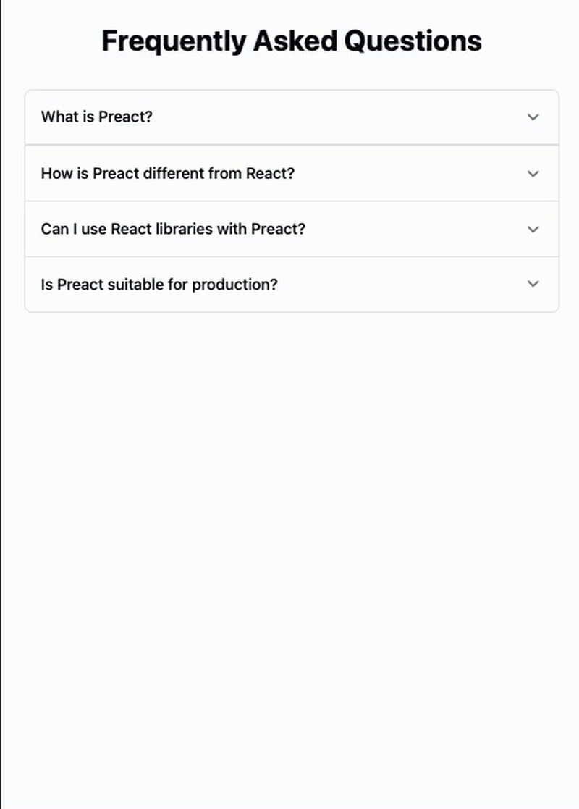
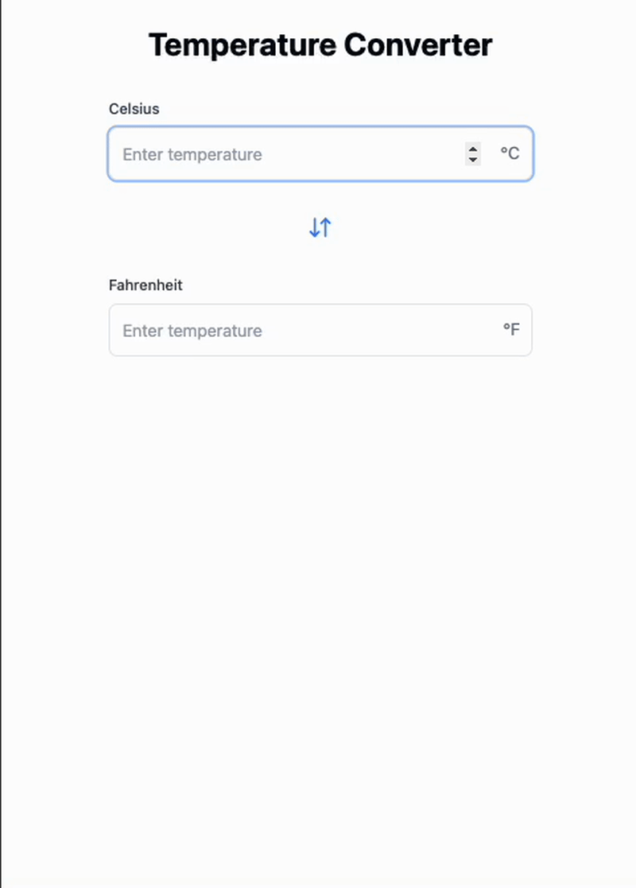
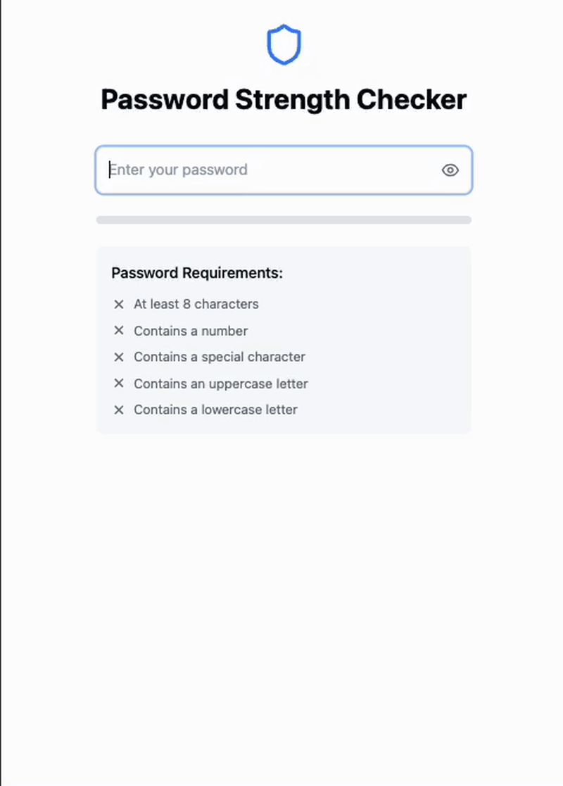
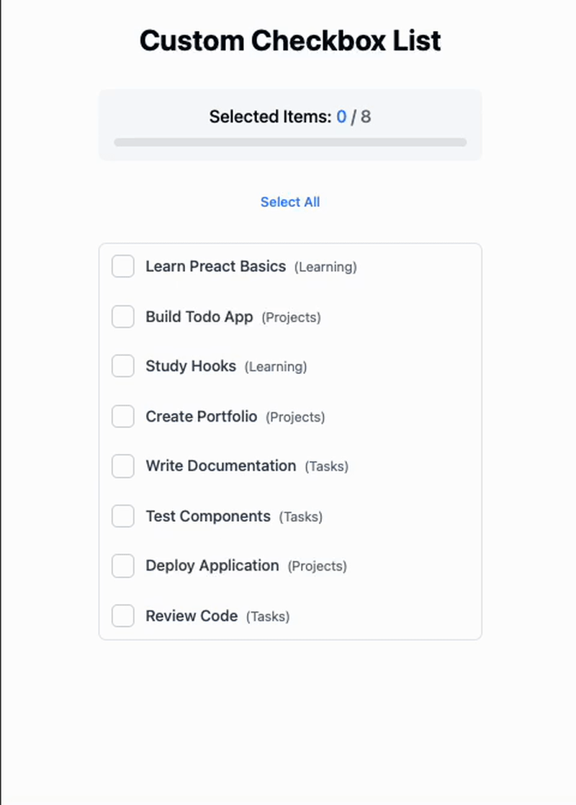
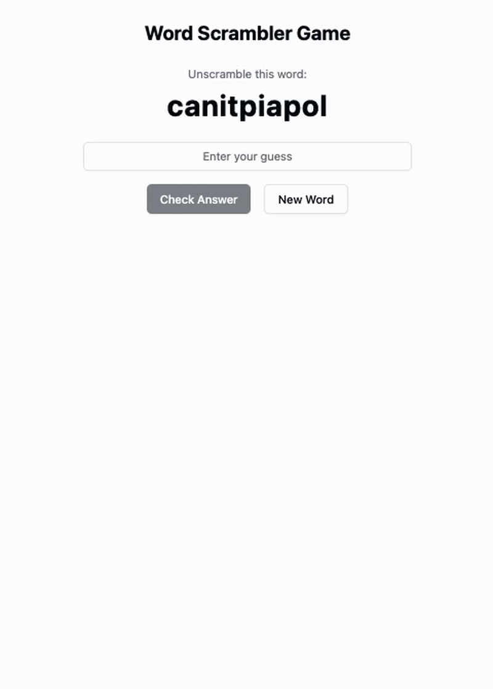

### Preact Frontend Assignment  
Create 10 small Preact applications, each consisting of no more than 3-4 components. Each problem focuses on a unique concept to help you practice Preact fundamentals. Use functional components and Preact hooks where applicable. Keep the UI simple and functional.  

---

### Problem 1: **Emoji Searcher**  
**Description:** Build an app that lets users search for emojis by keyword. Display a list of emojis matching the search term.  
**Components:**
- `App`: Main container
- `SearchBar`: Input field for search
- `EmojiList`: Displays filtered emojis  

---

### Problem 2: **Character Counter**  
**Description:** Create a live character counter that shows the number of characters entered in a textarea.  
**Components:**
- `App`: Main container
- `TextArea`: Input field for text
- `Counter`: Displays character count  

---

### Problem 3: **Random Quote Generator**  
**Description:** Display a random quote from a list of quotes. Include a button to fetch a new random quote.  
**Components:**
- `App`: Main container
- `QuoteDisplay`: Shows the current quote
- `NewQuoteButton`: Button to get a new quote  

---

### Problem 4: **Accordion FAQ**  
**Description:** Implement a simple FAQ accordion where clicking on a question toggles the visibility of the answer.  
**Components:**
- `App`: Main container
- `FAQItem`: Displays a question and its answer  
- `FAQList`: Renders multiple `FAQItem`s  

---

### Problem 5: **Temperature Converter**  
**Description:** Create a temperature converter that converts between Celsius and Fahrenheit.  
**Components:**
- `App`: Main container
- `TemperatureInput`: Input for temperature value
- `ResultDisplay`: Displays the converted value  

---

### Problem 6: **Image Carousel**  
**Description:** Implement an image carousel that lets users cycle through images with "Next" and "Previous" buttons.  
**Components:**
- `App`: Main container
- `ImageDisplay`: Shows the current image
- `NavigationButtons`: Controls for navigation  

---

### Problem 7: **Password Strength Checker**  
**Description:** Check the strength of a password and display feedback (e.g., weak, medium, strong) based on its length and complexity.  
**Components:**
- `App`: Main container
- `PasswordInput`: Input field for the password
- `StrengthIndicator`: Shows the strength level  

---

### Problem 8: **Custom Checkbox List**  
**Description:** Display a list of items with custom checkboxes. Toggling checkboxes should update the count of selected items.  
**Components:**
- `App`: Main container
- `CheckboxItem`: Individual checkbox item
- `SelectedCount`: Displays the total number of selected items  

---

### Problem 9: **Notification Toasts**  
**Description:** Show temporary notification toasts that disappear after a few seconds. Include a button to trigger a new notification.  
**Components:**
- `App`: Main container
- `Notification`: Displays a toast message
- `TriggerButton`: Button to create a new notification  

---

### Problem 10: **Word Scrambler Game**  
**Description:** Display a scrambled word and provide an input for the user to guess the correct word. Include a button to get a new scrambled word.  
**Components:**
- `App`: Main container
- `ScrambledWord`: Displays the scrambled word
- `GuessInput`: Input for user guess
- `NewWordButton`: Button to get a new word  

---

### Submission Guidelines:  
- Each problem should be implemented as a separate Preact project or folder.  
- Use functional components and Preact hooks (useState, useEffect, etc.).  
- Keep the UI clean and minimalistic.  
- Submit the source code in a zip file or through a GitHub repository link.  

Happy coding! 🚀